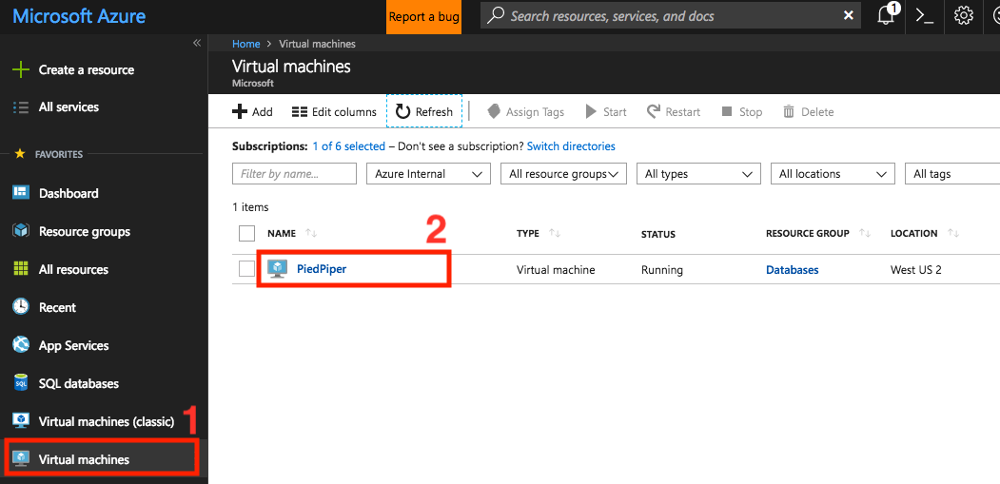
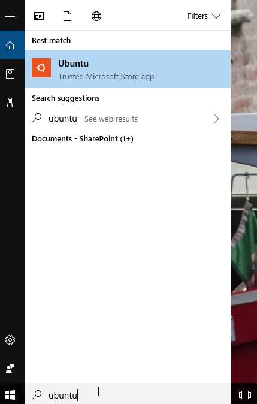
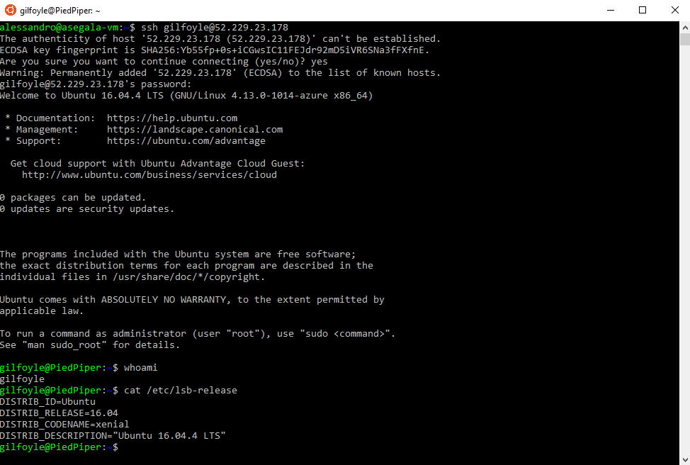

# Create a Linux Virtual Machine on Azure

## Overview

Virtual Machines are a core offering of Microsoft Azure. Users can create multiple VMs from images based on Microsoft Windows Server, as well as on many Linux distributions and BSD variants. Users can create VMs in 50 Azure regions worldwide, and can choose among a large number of configurations and specs.
 
## What is covered in this lab?

In this lab, you will:

* Sign in to the Azure Portal
* Deploy a Linux Virtual Machine on Azure
* Connect to the Linux Virtual Machine using SSH

## Exercise A: Create a Linux Virtual Machine using the Azure Portal

### Step 1: Log in to the Azure Portal

1. Open your browser inside the virtual desktop on the left and navigate to https://portal.azure.com

1. Login with the following username and password:
   > Username: ++@lab.CloudPortalCredential(1).Username++    
   > Password: ++@lab.CloudPortalCredential(1).Password++

### Step 2: Create a Linux VM

Once inside the Azure Portal, click on the "Create a resource" button on the top left corner. From the list of options, select Compute to view all kinds of VMs, then click on "See all".


A blade will appear showing a lot of different options for VMs. Some are base images for popular operating systems (including Windows, various Linux distributions, and some BSD variatns). Others are solution templates that automatically deploy multiple VMs (sometimes, dozens) pre-configured for running complex applications, such as Cloud Foundry, DC/OS, SharePoint, and more.

Feel free to browse through the list of VM images, or use the search bar to deploy your favorite **Linux distribution**.


> Not sure what to pick? Here are some ideas that you can search for in the Azure Marketplace:
>
> - Ubuntu Server 16.04 LTS
> - Red Hat Enterprise Linux 7.4
> - Debian 9 "Stretch"
> - CentOS-based 7.4 (*this is CentOS, distributed by Rogue Wave Software*)
> - CoreOS Linux (Stable)
> - Clear Linux OS Basic
> - openSUSE Leap
> - Kali Linux
> 
> Feel free to look for something exotic! 😉
> 
> Also, if you're more of a BSD kind of person, check out FreeBSD!

Once you've picked your favorite image, continue to the next blade. In the images below we're using Ubuntu Server 16.04 LTS as example, but the steps are the same for all other Linux and BSD images.

Make sure that deployment model is "Resource manager" (the default), then click on Create.


You will have to specify a few options:

- Give your VM a name so it's identifiable in the Azure Portal. This will also be the VM's default hostname.
- As disk type, choose "SSD". This will make sure that the VM's OS disk is backed by SSD. The OS disk is always persistent and safely stored in Azure Storage, where it's replicated 3 times.
- Choose the login username (a UNIX username) and password. On a production environment you'll likely want to use SSH public keys instead.
- You should have access to a single Subscription and Resource Group only, already created for you.
- Location is the Azure Region where your VM is deployed. You can choose any Region around the world (*please note that your free lab subscription might not be enabled for all Azure Regions*).


The next step is about choosing a size for your VM. Azure offers multiple VM sizes, optimized for different use cases. The main ones are:

- B-series VMs are burstable. They're the cheapest ones, and offer a baseline performance with the ability to burst CPU usage for a short period of time. They're ideal for smaller applications, web servers, small databases, test environments, etc.
- D-series VMs (Dv3, Dv2 and D) are general purpose VMs, suitable for most workloads
- F-series VMs (Fv2 and F) are optimized for CPU-intensive workloads, and have a higher CPU-to-memory ratio.
- E-series VMs (Ev3) are optimized for applications that require a higher memory-to-CPU ratio.

There are many more sizes, designed to accomodate workloads that require GPUs (e.g. for AI or rendering), for high-performance computing, SAP HANA, and more. The [Azure documentation](https://docs.microsoft.com/en-us/azure/virtual-machines/linux/sizes) does a great job explaining all sizes, if you're curious.

In this example, we're picking a B2s VM.


The last step has some advanced configuration options:+

- You can configure Availability Zones and Availability Sets for high availability when you have 2 or more VMs sharing a workload, up to 99.99%. In this example, do not use Availability Zones and leave Availabily Set to "none".
- Use Managed Disks, and choose a default size for the OS disk.
- This blade allows you to configure the VM's networking profile too. Each VM on Azure is placed in a Virtual Network, which is a private, isolated network inside the Azure fabric, so your VMs can communicate with each other using private IP ranges (such as 10.0.0.0/8), safely. You can also control the allocation of a public IP address if you want your VM to be reachable from clients over the Internet (or not), and you can configure Network Security Group to control traffic (they're essentially firewall rules). For now, leave all settings as default, so a Virtual Network is created with the default options, a public IP is allocated and a Network Security Group is created to allow traffic to port 22 (SSH) only.
- Do not add any extension for now; these could be useful to run a script at the VM startup, for example.
- Disable Boot and Guest OS diagnostic.
- Disable Backup for this lab (although it's a great feature to have in a real-world scenario).


Finally, in the last step you just need to confirm the creation of the VM. You'll be shown the total cost of each VM per hour, which includes the cost of the Azure infrastructure (the compute resources) as well as optionally the cost for the VM image. While most images on the Azure Marketplace are free, some charge an extra fee to cover the licensing cost, such as Red Hat Enterprise Linux.


The creation of the VM will take a couple of minutes. Sit back and relax, or take this time as an opportunity to explore the Azure Portal.

### Step 3: Connect to the VM via SSH

Once your VM is up, it should be ready to accept connections via SSH!

On the Azure Portal, select "Virtual Machines" (*not Classic*) on the left sidebar. The VM you just created should appear in the list on the right. Once it's ready, the status will be "Running". Click on the VM to expand its details.



The VM blade has a lot of information! You can see information about the VM, as well as metrics on CPU and memory usage, network and disk I/O, etc. For now, select the Public IP address and copy it.


At this point, connecting to our VM is as easy as opening the terminal and connecting to it via SSH, as you would do with any other Linux/BSD VM.

The remote desktop should have the "Windows Subsystem for Linux" installed, which allows you to run Linux binaries natively on top of the Windows kernel, including OpenSSH. You can choose what Linux distribution to use; the remote desktop has Ubuntu pre-configured. To open it, click on the Windows start button, then type "Ubuntu" and select the first result.



> The remote desktop should have PuTTY installed too, if you are more familiar with that tool.

You will see a Bash terminal ready to be used. Type the following command to connect to your VM via SSH:

````sh
ssh [username]@[VM Public IP]

# For example:
ssh gilfoyle@52.229.23.178
````

Hit return, accept the public key (type `yes` and hit return again), type the password for the VM you set up in the step above, and you'll be connected to your VM on Azure!



## Next steps

The lab is done! You have now a Linux/BSD VM running on the cloud on Azure, and you've successfully connected to it.

While this lab is over, there's definitely much more about using VMs on Azure. Feel free to explore the features of the Azure Portal: for example, add data disks to your VM, configure the firewall (Network Security Group), enable backups, or whatever else you want to try!
