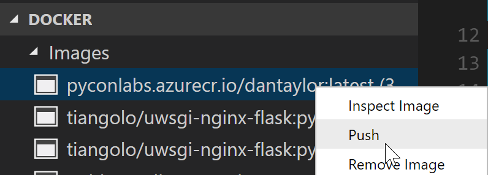

# Deploy a docker image to Azure Web Apps for Containers

Starting with the sample app provided, you will create an Docker image, Azure Container Registry, and Azure Web App that uses the registry and Docker image.

1. [ ] In the `app/main.py` file, modify the "Hello World!" message on line 6 to a fun message of your choice, type in some HTML if you want!

2. [ ] Open the integrated terminal in VS Code by pressing ``Ctrl-` ``

3. [ ] Build the docker image by typing `docker build -t pyconlabs.azurecr.io/<app_name>:latest .`, make sure to pick a unique name for `<app_name>`, e.g. `<your_name>lab`

4. [ ] In the docker tab of the explorer, right click on the container named `pyconlabs.azurecr.io/<app_name>` and select Push


5. [ ] Right->click Deploy to Azure App service, in the series of menus pick:
 - `DockerLab` for the resource group
 - `DockerLabPlan` for the app service plan name
 - `B1 Basic` for the plan SKU
 - Name the site using the same `<app_name>` you picked above

6. [ ] Run the following commands from the terminal to set the port number on the site and restart it:
```
az webapp config appsettings set --name <app_name> --resource-group DockerLab --settings  WEBSITES_PORT=8000
az webapp restart --name <app_name> --resource-group DockerLab
```

7. [ ] Browse to ```<app_name>.azurewebsites.net``` to see your message!
