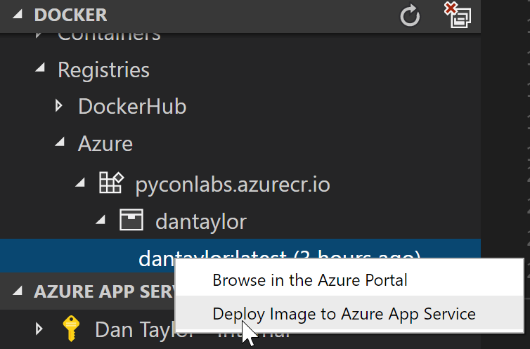

# Deploy a docker image to Azure Web Apps for Containers

## Overview

VS Code extensions are a way to customize your development environment with the exact tools you need. The Docker extension makes it easy to build and deploy containerized applications from Visual Studio Code and includes functionality:

- Automatic Dockerfile and docker-compose.yml file generation
- Syntax highlighting and hover tips for docker-compose.yml and Dockerfile files
- IntelliSense (completions) for Dockerfile and docker-compose.yml files
- Linting (errors and warnings) for Dockerfile files
- Command Palette (F1) integration for the most common Docker commands (e.g. Build, Push)
- Explorer integration for managing Images and Containers
- Deploy images from DockerHub and Azure Container Registries to Azure App Service

## What is covered in this lab?

In this lab, you will:

- Create a Docker image using a provided Python application and Dockerfile
- Create an Azure Container Registry and Azure Web App
- Configure your Web App to use your Docker image from the Azure Container Registry

## Part A: Create a Docker container in VS Code

1. [ ] In the `app/main.py` file, modify the "Hello World!" message on line 6 to a fun message of your choice, type in some HTML if you want!

2. [ ] Open the integrated terminal in VS Code by pressing ``Ctrl-` ``

3. [ ] Build the docker image by typing `docker build -t pyconlabs.azurecr.io/<app_name>:latest .`, make sure to pick a unique name for `<app_name>`, e.g. `<your_name>lab`

## Part B: Create Web App and Azure Container Registry

4. [ ] In the docker tab of the explorer, right-click on the container named `pyconlabs.azurecr.io/<app_name>` and select Push


5. [ ] Right->click Deploy to Azure App service, 



In the series of menus enter:
 - `DockerLab` for the resource group
 - `DockerLabPlan` for the app service plan name
 - `B1 Basic` for the plan SKU
 - The same `<app_name>` you picked above for the site name

## Part C: Final configuration

6. [ ] Run the following commands from the terminal to set the port number on the site and restart it:
```
az webapp config appsettings set --name <app_name> --resource-group DockerLab --settings  WEBSITES_PORT=8000

az webapp restart --name <app_name> --resource-group DockerLab
```

7. [ ] Browse to ```<app_name>.azurewebsites.net``` to see your message!
