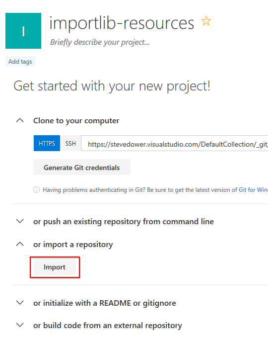
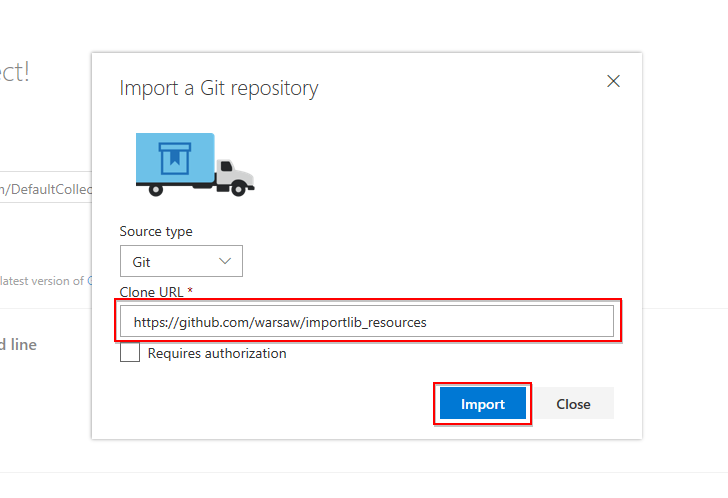
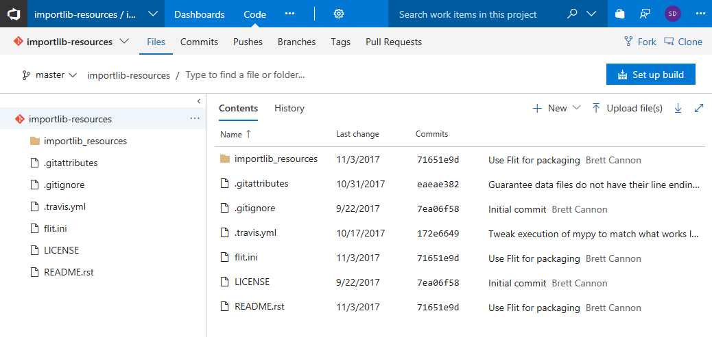
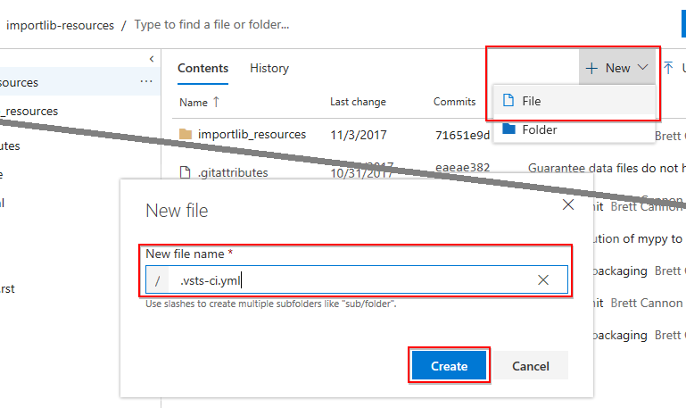
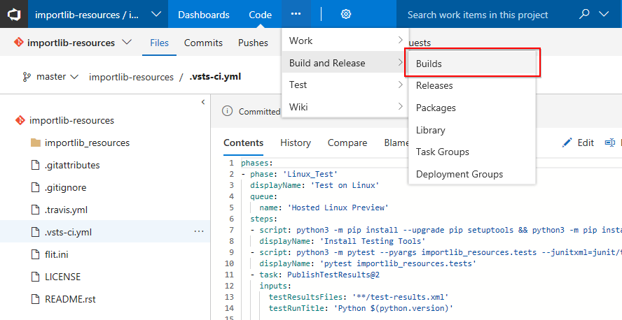
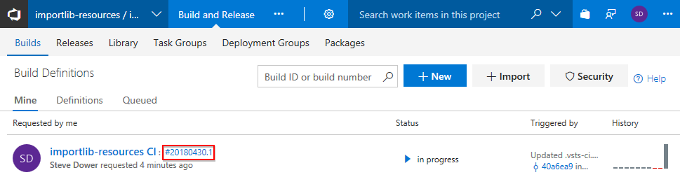
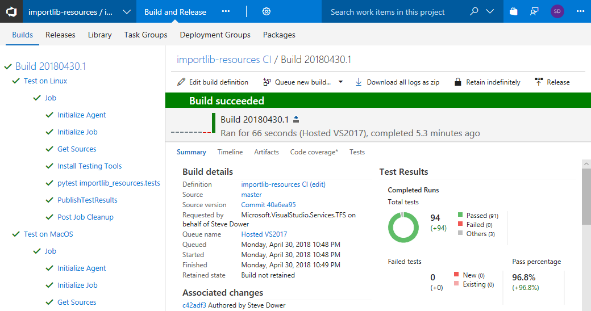
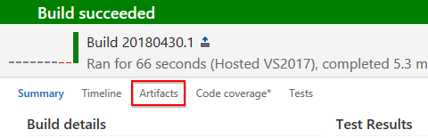
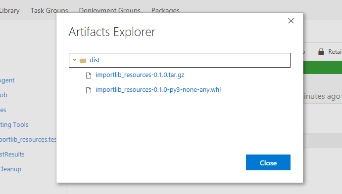

# Build a Python package with Visual Studio Team Services

## Overview

Visual Studio Team Services is a set of online tools for everything from code, build, test and publish through to work tracking and dependency management. With unlimited private git repositories, access to Linux, MacOS and Windows build machines, a rich extension ecosystem, and the ability to scale up as your projects grow, there is no better place for your code to live.

## What is covered in this lab?

In this lab, you will:

* Create a Visual Studio Team Services instance
* Import an existing project from GitHub
* Create a build definition as a version-controlled file in your project
* Review test results and download the build outputs

## Part A: Create Visual Studio Team Services account

First, we will provision a Team Services account.

1. Open your browser and navigate to https://www.visualstudio.com/team-services/. Select **Get started for free**

1. Login with the username and password at the top of the lab.

1. Provide a name for your Visual Studio Team Services account and click **Continue** to start the creation process. (The name is not important and will be deleted after completing this lab.)

1. In 1-2 minutes your account will be ready with a default project created.

For this lab, we are going to use YAML builds. These are currently in preview and need to be enabled. To enable YAML builds:

1. Click on the user icon in the top right of the page (it will probably have two letters in a circle).

1. Select "Preview Features", and then change the dropdown to show features "for this account".

1. Change the YAML Builds option to *On*. Confirm the change and close the settings panel.

## Part B: Import an existing project

1. Navigate to the Code hub. Since there is no code yet, you wil see an empty repository. For this lab, we will be importing a repository from GitHub.

  

1. Copy and paste the URL below and click **Import**. No authorization is required, as this is a public repository.
   > URL: ++https://github.com/warsaw/importlib_resources++

  

1. Wait until the repository import has been completed and the files are displayed. Take some time to browse the contents of the repository before continuing.

## Part C: Configure test and build

In this part, we will create a build definition as a YAML file in the repository. Keeping the definition as code makes it easy to propose and review changes to the build, as well as tracking changes over time.

1. In the Files view of your imported repository, select the top level directory.

  

1. Click **New** and select **File**. As the filename, enter ++.vsts-ci.yml++ and click **Create**.

  

1. Copy and paste the code below into the editor. This build definition will run tests on both Linux and MacOS, and if all tests pass, will generate a wheel and sdist.

> [!KNOWLEDGE] An **sdist** is a source distribution containing Python code. Users can install sdists using **pip**, but if native source files are included they may need a compiler to complete installation. A **wheel** is precompiled, so if a wheel is available for their platform, users can install the package without needing a compiler.

```yaml
phases:
- phase: 'Linux_Test'
  displayName: 'Test on Linux'
  queue:
    name: 'Hosted Linux Preview'
  steps:
  - script: python3 -m pip install --upgrade pip setuptools && python3 -m pip install pytest
    displayName: 'Install Testing Tools'
  - script: python3 -m pytest --pyargs importlib_resources.tests --junitxml=junit/test-results.xml
    displayName: 'pytest importlib_resources.tests'
  - task: PublishTestResults@2
    displayName: 'Publish test results'
    inputs:
      testResultsFiles: '**/test-results.xml'
      testRunTitle: 'Linux'

- phase: 'macOS_Test'
  displayName: 'Test on macOS'
  queue:
    name: 'Hosted macOS Preview'
  steps:
  - script: python3 -m pip install --upgrade pip setuptools && python3 -m pip install pytest
    displayName: 'Install Testing Tools'
  - script: python3 -m pytest --pyargs importlib_resources.tests --junitxml=junit/test-results.xml
    displayName: 'pytest importlib_resources.tests'
  - task: PublishTestResults@2
    displayName: 'Publish test results'
    inputs:
      testResultsFiles: '**/test-results.xml'
      testRunTitle: 'macOS'

- phase: 'Publish'
  displayName: 'Publish'
  dependsOn:
  - 'Linux_Test'
  - 'macOS_Test'
  queue:
    name: 'Hosted Linux Preview'
  steps:
  - script: python3 -m pip install --upgrade pip setuptools && python3 -m pip install --upgrade flit
    displayName: 'Install Build Tools'
  - script: python3 -m flit build
    displayName: Build Packages
  - task: PublishBuildArtifacts@1
    displayName: 'Publish artifacts'
    inputs:
      pathToPublish: 'dist'
      artifactName: 'dist'
      artifactType: 'container'
```

1. Click **Commit** to add this file directly to the master branch of your repository.

## Part D: Review build results

Adding a `.vsts-ci.yml` file automatically configures the build, so there are no further steps. Let's take a look at the build that is now running.

1. Hover over **Build and Release** and select **Builds** from the menu. You will see one build definition listed for your repository that is currently **In progress** (or perhaps even complete!)

  

  

> [!KNOWLEDGE] You can manually create build definitions from this page by selecting **New**. This offers a range of templates and tasks, and keeps the build separate from your code. After creating a build definition in this way, you can export it as YAML through the **View YAML** commands.

1. Click on the version number to jump to the build page. You will see a tree of build tasks on the left hand side. Selecting any of these will display the logs from that step. On the right hand side is a summary of the build, including new commits since the last build and test results.

  

1. If the build was successful, select the **Artifacts** tab to view the generated outputs. Click **Explore** to view and download individual files.

  

  

> [!NOTE] If any tasks failed, they will be marked with a red cross in the tree at the left. Select the failed task to review its logs.

## Part E: Future possibilities

Congratulations, you have successfully tested and built your first Python package on Visual Studio Team Services!

From here, you could extend your build definition to cover more versions of Python, use a mix of custom and hosted build machines, link directly to a GitHub project to be able to build pull requests, or more.

Successful builds can automatically trigger release pipelines, which allow you to perform extended testing and automatically (or with manual approval) upload packages to PyPI, deploy web sites to Azure, or perform a range of other tasks.
